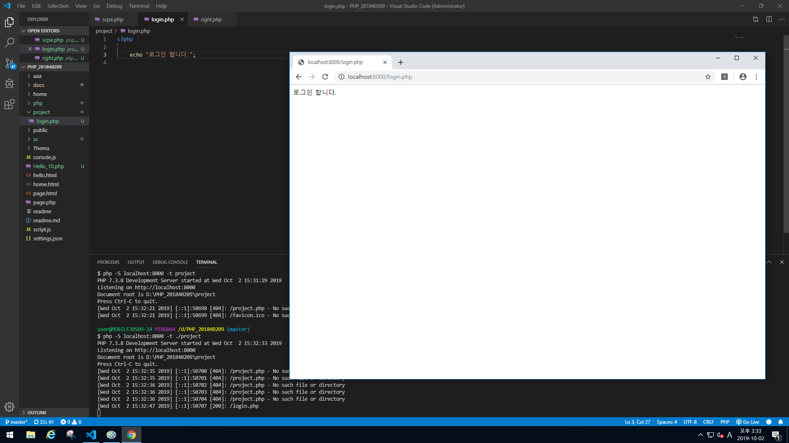
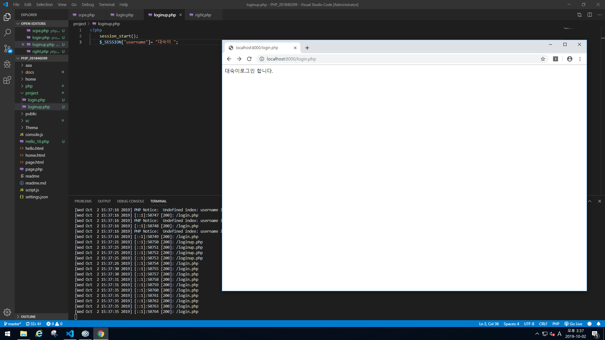
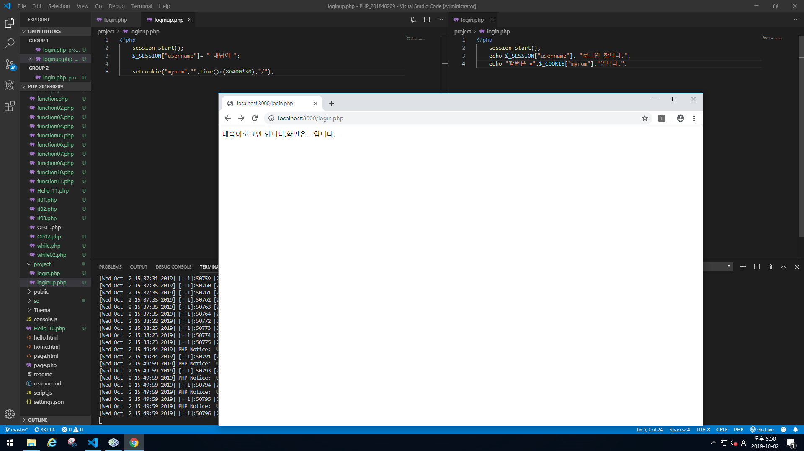
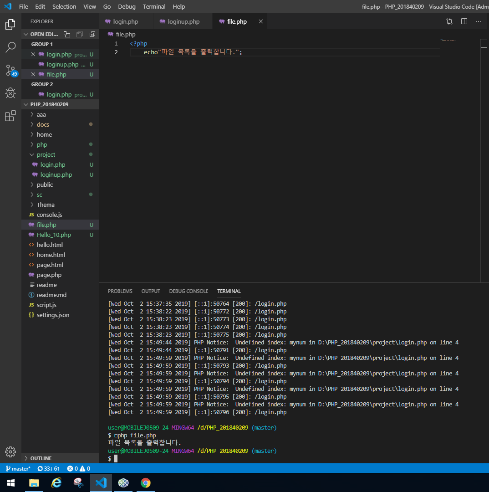
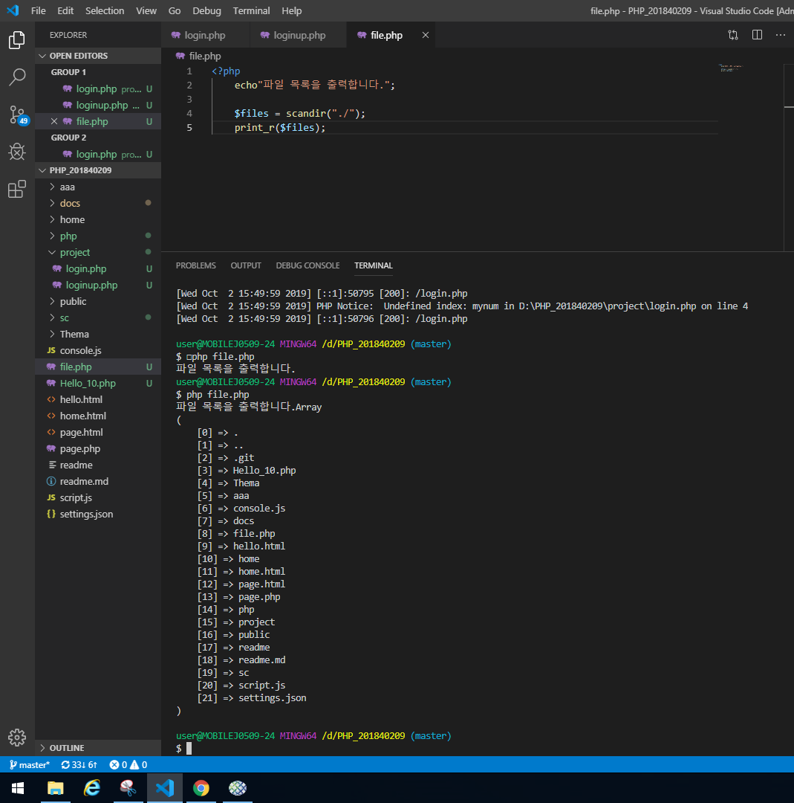
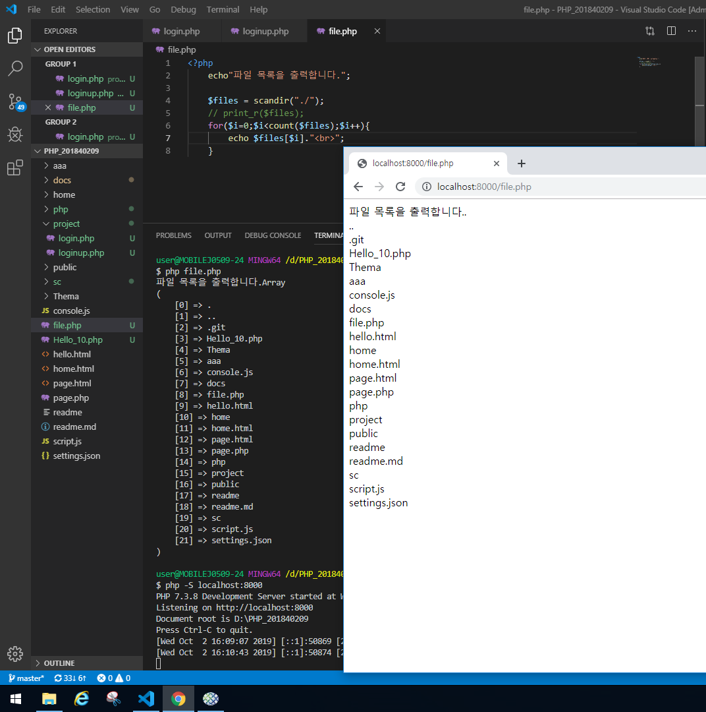
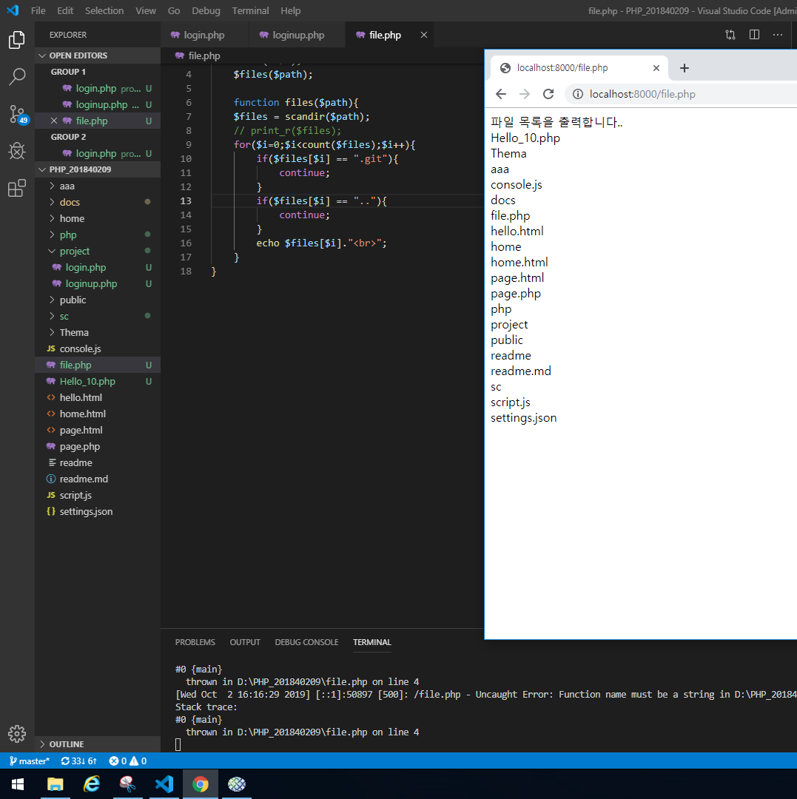
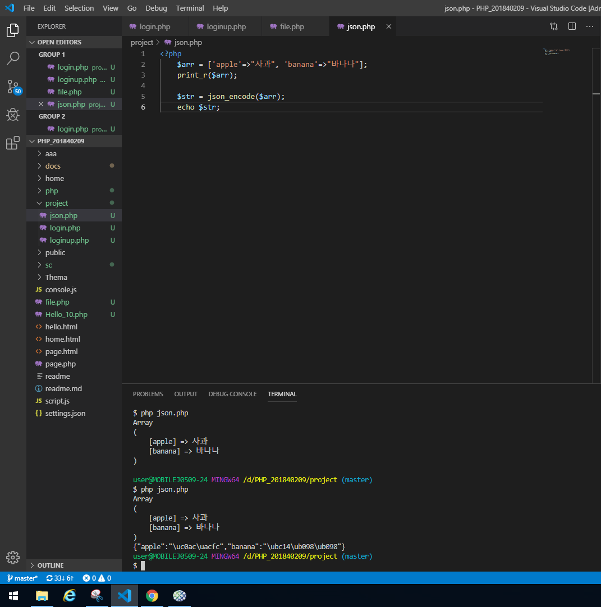

# 2019.10.02 (5주차)

## PHP 정리

1. php는 컴파일이 아니라 인터프리터 언어이다.

    2. 개발속도가 C언어보다 php가 빠르다. 그 이유는 프로그램 수정시 컴파일러를 거치지 않기 때문.

    3. 반대로 처리속도(실행)는 php가 C언어보다 느리다.

    4. php는 서버사이트 언어이다. 서버에서 데이터를 처리하여 브라우저로 전송을 한다. 서버는 별도의 서버사이드 언어를 사용하는대 데이터를 처리하기 위함.
    
    5. php는 웹개발을 쉽게하기 위해 고완된 언어이다.
    
    6. 가장 많이쓰는 서버는 아파치 톰캣과, IIS 이다.
    
    7. 많이 쓰는언어는 ASP,JSP,PHP 이다. ASP는 IIS, JSP는 톰캣, PHP는 아파치 이런식으로 많이 사용한다.
    
    8. op캐시는 임시로 인터프리터로 해석된 소스를 임시로 저장해둔다. PHP의 문제를 개선하기위해 만들어진것. 개발할때는 Off 오픈하여 운영할시에는 On해서 사용하면 됨.
    
    9. 속도개선 처리를 위해 php코드를 바이트 코드로 생성한다.위에서 설명했듯이 op캐쉬 말이다.
    
    10. php는 C언어와 유사한 문법 구조를 가지고 있다.
    
    11. php언어는 오픈소스이다. 모든 소스가 공개되고 무료로 사용을 할 수 있다. 
    
    12. php는 리눅스 서버(apache)이외에 윈도우 서버(IIS)에서도 동작을 한다.
    
    13. php도 html도 중간에 코드를 삽입하여 작성이 가능하다. 일명 스파게티 코드라고 한다.
    
    14. php에서 주석코드는 /*, // 이다. phpdocs은 /** */ 이런것도 있다. 이것을 중첩해서 사용하면 문법에러가 발생한다.
    
    15. PSR에서 php파일은 utf-8 타입으로 저장을 권장한다.
    
    16. 상수, 변수, 함수명, 클래스 모두 중복된 이름은 사용할 수 없다. 변수나, 상수는 모두 대소문자를 구분한다. php는 변수를 사용할 때 자동으로 생성이 된다. 문자열은 배열로 되어있어 접근 및 수정이 가능하다.
    
    17. 예를들어 hello 는 0번 배열부터 h, e, l, l, o 이렇게 저장이 된다.
    
    18. php 서버 실행 문구는 php -S localhost:8000 이다.8000뒤에 -t를 붙여 시작폴더를 지정할수있다.
    
    19. php폴더 안에 docs폴더 안에있는 인덱스 파일을 쓰고싶다면 docs폴더 안에 들어가 시작하는 방법도 있고 php폴더에서  
    php -S localhost:8000 -t docs. 를 입력해주어야 한다. 서버 종료시에는 ctrl + C 를 입력하면 종료된다.
    
    20. APM은 apache + php + mysql 불림. 보통 php 통합 환경 APM이라는 단어를 쓴다.
    
    21. php 버전 확인은 php -v 시작기호는 <?php 이다.
    
    22. $a - 10/0 논리 오류가 발생한다. php에서 PSR 규격에서 들여쓰기는 4칸이다. php에서 정의하는 반복문은 for, foreach, while, do-while 이다. 각각 지정 반복, 객체 반복, 조건 반복, 1회통과 조건 반복 이다.
    
    23. 매직메서드?
        - 우선 매직메서드는 __construct(), __destruct()이다. 우선 __construct()는 클래스에 생성자로 클래스 인스턴스화 시 처음으로 호출한다.
        - CI에 보면 parent::__construct();를 호출하는 것을 종종 보게 되는데, __construct()는 상속 시 부모의 생성자를 자동으로 호출하지 않는다.
        - __destruct()는 클래스의 소멸자로 인스턴스 파괴 시 호출된다. 마찬가지로 상속한 부모의 소멸자는 자동으로 호출하지 않으므로 parent::__destruct()를 호출해야 한다.
        - get,set,isset,unset,call,callstatic,tostring,debuginfo가 있다.
        -  __get()은 클래스의 프로퍼티 값을 조회했을 때 실행된다. __set()는 클래스의 프로퍼티 값을 지정했을 때 실행된다.
        - __isset()은 클래스 내의 프로퍼티를 isset()했을때 실행되는 메소드이다. __unset()은 클래스 내의 프로퍼티를 unset()했을때 실행되는 메소드이다.
        - __call()은 클래스에 정의되지 않은 메소드를 호출했을 때 실행되는 함수이다. __callstatic()은 _call()과 같은 기능이지만 static으로 메소드를 호출했을 때 실행되는 함수이다.
        - __toString()은 클래스의 인스턴스의 상태를 확인하기 위한 인스턴스의 문자열화를 진행한다.
        - __debugInfo()은 클래스의 인스턴스를 var_dump()했을 때 호출되는 메소드이다.
    
    24. php는 순차적, 절차적,개체지향적 프로그래밍이 있다.
        - 순차적 프로그래밍은 말 그대로 순차적으로 흘러가는 프로그래밍 구조를 의미한다.
        - 보통 코딩 패러다임을 설명할때 가장 초기에 등장한 코딩 패러다임이라고 부른다.
        - 그도 그럴것이 모든 프로그램은(그 어떠한 프로그램이던 간에) 코드를 순서대로 읽는다.
        - 그렇다고 모든 코딩 패러다임이 순차적 프로그래밍은 아니다.여기서 말하는 순차적 프로그래밍이란것은 순차를 중점으로 본다는 이야기가 되겠다.
        - 즉 코딩을 코드의 흐름,순서에 기반하는 프로그래밍이라는 것이다.이 코딩패러다임에서는 구조라는 개념이 없다.
        - 여기까지가 순차적 이다. 사실상 순차적 절차적 객체지향적 전부다 장단점이 있지만 마지막에 서술함.
        
        - 절차적 프로그래밍은 어떤 목적을 달성하기 위해 프로그램이 '어떻게(=로직)' 작동하는지가 중요하다.
        - 함수가 중심이되고 데이터는 보조 기능을 하는 언어 즉, 프로그래밍을 할때, 프로그램 전체 구조는 함수를 기준으로 디자인 되고, 데이터는 한 함수에서 다른 함수로 전달되게 함.
        - 객체지향적 프로그래밍은 클래스를 여러 함수들을 하나로 정리하는 프로그램의 단위이다. 클래스에 정의된 함수를 '메서드'라고 한다.
        - 각각의 장단점.
        - 1.순차적 프로그래밍은 우리가 보기쉽게 위에서 아래로 내려가며 사용하는 코딩박식 그대로 읽어오는 순서도 위에서 아래로 읽어온다. 쉽게말해 구조라는 개념이 없다.
        - 코딩을 코드의 흐름과 순서에 중심이 되어 본다. 보통 순차적 프로그래밍은 goto를 이용하여 사용하게 되는대, goto문이 길어지면 길어질수록 현재 우리가 사용하는 빠른 속도를 얻기가 어려워진다.
        - 어째서 느려지나?
        - 코드를 순차적으로 불러와 읽기때문에 원하는 답을 찾기가 매우 느려질수밖에 없다.
        - 나는 99번째 줄의 답을 얻어야하는대 1번부터 98번째 줄의 코드를 하나하나 읽어오기 때문
        - 2.절차적 프로그래밍은 절차지향이라고 하는 사람들이 있는대 Procedual 즉 함수가 된다.
        - 절차적이라는 것보단 함수지향이라고 하는게 더 맞을것 같다.
        - 순차적 프로그래밍보다는 좀더 발전된 프로그래밍이다. 예전에 goto가 사용되던 때 보단 for같은 반복문으로 구성되어있다. 전보단 좀더 빠른것이 장점.
        - 문제는 프로시저라는 것은 추상적인 부분이 매우 강한 단위이다. 무조건적으로 추상적으로 사용되진 않지만 물리적으로 메모리에 저장하는 부분도 있고 그 메모리에 저장되어있는 것을 관리하는 논리적 단위가 프로시저이다.
        - 절차적 프로그래밍에서는 물리적인 요소(변수나 상수등의 값들)을 관리하는 방법에 대해서는 깊게 논하지 않기에 그것까지 관리하는데는 문제가 생기기 마련이다.
        - 순차적과 절차적부분에서 문제가 되는 부분이 각각 다른 형식의 값이 자료형과 그것을 사용할 함수는 따로따로 만들어야한다.
    25. 객체지향은?
    
    26. 그럼 여기서 해결책은 생각보다 간단하다. 특정 개념의 함수와 자료형을 함께 묶어서 관리하면 되지 않나 하는 것이다.
    
    27. 그렇게 해서 탄생한것이 객체 지향 프로그래밍이다. 객체 지향 프로그래밍에서 중요한 점은 모든 객체는 그 내부에 자료형(Field)와 함수(Method)가 존재한다.

    28. 이로 인해서 책이라는 자료를 객체 모델로 만든다면 그 책의 쪽수나,이름과 같은 자료형 뿐만 아니라 책을 읽기, 책을 만들기 등의 함수들 역시 "책"이라는 객체로 묶어 놓는 것이다.
    
    29. 이렇게 객체 지향 프로그램은 가능한 모든 물리적, 논리적 요소들을 객체로 만드려고 한다.일단 객체라는 한 개체로 완성되면 그 객체는 다른 객체로 부터 높은 수준의 독립성을 완성했다고 할 수 있다.이렇게 하면 코딩할때 극 초반에만 조금 불편해진다.

    30. 그러나 시간이 지날수록 중복코딩이 굉장히 줄게되며 객체와 객체간에 독립성이 확립되므로 유지보수에 도움이된다.

    31. 쿼리스트링이란?
        - 데이터를 전달하기 위한 URL의 일부분
        - GET 방식 파라미터 전달 문자열
        - 주소 다음에 붙는 '?' 다음부분들
    32. hppts://a.com/da 라는 웹사이트가 있다면 hppts://a.com/da?id=1 이라는 문구가 있다면 id=1이 쿼리 스트링이다.

    33. 세션(session)이란 웹 사이트의 여러 페이지에 걸쳐 사용되는 사용자 정보를 저장하는 방법을 의미한다. 사용자가 브라우저를 닫아 서버와의 연결을 끝내는 시점까지를 세션이라고 한다.

    34. 하지만 세션은 서비스가 돌아가는 서버 측에 데이터를 저장하고, 세션의 키값만을 클라이언트 측에 남겨둔다.

    35. 브라우저는 필요할 때마다 이 키값을 이용하여 서버에 저장된 데이터를 사용하게 된다. 이러한 세션은 보안에 취약한 쿠키를 보완해주는 역할을 하고 있다.

    36. PHP에서는 session_start() 함수를 이용하여 새로운 세션을 시작하거나, 기존의 세션을 다시 시작할 수 있다.

    37. 세션이란?
        - session
        - SID(session ID)를 식별자로 서버에 데이터를 저장
        - session_start(); 로 시작, 스크립트의 최상단에 위치해야함
        - $_SESSION
        - 데이터는 서버 내에 파일이나 DB에 저장함
        - 주로 사용자 인증시에 사용됨

    38. 쿠키란?
        - 쿠키는 사용자를 식별하는데 종종 사용됨
        - 사용자의 컴퓨터에 내장된 서버의 작은 파일임
        - 브라우저와 함께 페이지를 요청한다. 이때 쿠키도 같이 전송함
        - php에서 값을 생성하고 검색할 수 있다.
    
    39. php 파일리스트를 읽어오는 함수 readdir(), opendir(), closedir(), is_dir()이다.

    40. 해당 디렉토리의 엔트리를 얻고자 할때의 방법은 몇가지 있다. dir클래스를 이용하거나 readdir, scandir을 이용하는 것입니다.

    41. 디렉토리의 엔트리를 가져오기 위해서 폴더를 먼저 오픈하고 읽기 그리고 닫기 순으로 작성하면 된다. "."과 ".."은 기본적으로 엔트리로 가져오게 된다. 이를 제외시켜줄 필요가 있으며 폴더와 파일을 구분지어 정리해 줄 필요가 있다.

    42. readdir 함수로 엔트리를 얻을 수 있지만 opendir 함수와 closedir 함수가 필요하다. 순서는 opendir 열고 readdir읽고 closedir닫는다.

    43. 참고로 scandir 함수는 PHP5 이상부터 지원 한다. 이하버전에서는 위에 적힌대로 해야하지만 PHP5부터 scandir로 한번에 처리가 가능해졌다.

    44. 2019.10.02 오후 11시 46분 작성 완료
    
    
    
    
    
    
    
    
    